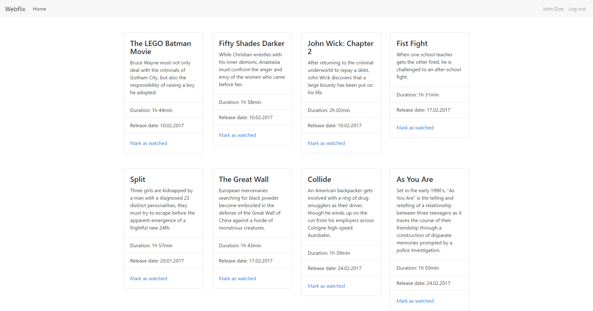

# Webflix

**Webflix is dummy Laravel application which simulates Netflix. You can log in, browse movies and mark movies watched.**

> This application is used for creating tutorials on how to deploy a Laravel application from GitHub to Heroku using Codeship for continuous integration and deployment.



## Installation

1. Fork the repository
2. Copy `.env.example` to `.env` and modify the values to match your environment
3. Run `composer install` to install dependencies
4. Run `php artisan key:generate` to set an Encryption Key
5. Run `php artisan migrate --seed` to migrate the database and seed it with movies and a user
5. Run `php artisan serve` to serve the application using a built-in PHP server or serve the application using [Homestead](https://laravel.com/docs/5.4/homestead)

## Login credentials

Email: `test@test.com`    
Password: `secret`

## Testing

The application uses [Codeception](http://codeception.com/) for testing. You can run tests with the following command:

```
vendor/bin/codecept run functional
```

See `.env.testing` for testing environment configuration. Tests are located in `tests/functional` directory.
